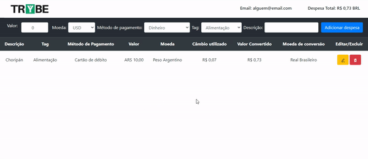

Ao iniciar este projeto, você concorda com as diretrizes do Código de Ética e Conduta e do Manual da Pessoa Estudante da Trybe.

# Boas vindas ao repositório do projeto Trybe Wallet!

Você já usa o GitHub diariamente para desenvolver os exercícios, certo? Agora, para desenvolver os projetos, você deverá seguir as instruções a seguir. Fique atento a cada passo, e se tiver qualquer dúvida, nos envie por _Slack_! #vqv 🚀

Aqui você vai encontrar os detalhes de como estruturar o desenvolvimento do seu projeto a partir deste repositório, utilizando uma branch específica e um _Pull Request_ para colocar seus códigos.


# Habilidades
Neste projeto, verificamos se voce é capaz de:

  * Criar um store Redux em aplicações React

  * Criar reducers no Redux em aplicações React

  * Criar actions no Redux em aplicações React

  * Criar dispatchers no Redux em aplicações React

  * Conectar Redux aos componentes React

  * Criar actions assíncronas na sua aplicação React que faz uso de Redux.

# Entregáveis

Para entregar o seu projeto você deverá criar um Pull Request neste repositório.

Lembre-se que você pode consultar nosso conteúdo sobre [Git & GitHub](https://course.betrybe.com/intro/git/) sempre que precisar!

---

## O que deverá ser desenvolvido

Neste projeto você vai desenvolver uma carteira de controle de gastos com conversor de moedas, ao utilizar essa aplicação um usuário deverá ser capaz de:
  - Adicionar, remover e editar um gasto;
  - Visualizar uma tabelas com seus gastos;
  - Visualizar o total de gastos convertidos para uma moeda de escolha;

## Desenvolvimento

Você deve desenvolver uma aplicação em React que use Redux como ferramenta de manipulação de estado.

Através dessa aplicação, será possível realizar as operações básicas de criação e manipulação de um estado de redux.

### Data de Entrega

  - Projeto individual.

  - Serão três dias de projeto.

  - O projeto tem até a seguinte data: `DD/MM/YYYY - 14:00h`. Para ser entregue a avaliação final.

---

## Instruções para entregar seu projeto:

### ANTES DE COMEÇAR A DESENVOLVER:

1. Clone o repositório
  * `git clone git@github.com:tryber/sd-0x-project-trybe-wallet.git`.
  * Entre na pasta do repositório que você acabou de clonar:
    * `cd sd-0x-project-trybe-wallet`

2. Instale as dependências e inicialize o projeto
  * Instale as dependências:
    * `npm install`
  * Inicialize o projeto:
    * `npm start` (uma nova página deve abrir no seu navegador com um texto simples)
  * Verifique que os testes estão executando:
    * `npm test` (os testes devem rodar e falhar)

3. Crie uma branch a partir da branch `master`

  * Verifique que você está na branch `master`
    * Exemplo: `git branch`
  * Se não estiver, mude para a branch `master`
    * Exemplo: `git checkout master`
  * Agora, crie uma branch onde você vai guardar os commits do seu projeto
---

### DURANTE O DESENVOLVIMENTO

* Faça `commits` das alterações que você fizer no código regularmente

* Lembre-se de sempre após um (ou alguns) `commits` atualizar o repositório remoto

* Os comandos que você utilizará com mais frequência são:
  1. `git status` _(para verificar o que está em vermelho - fora do stage - e o que está em verde - no stage)_
  2. `git add` _(para adicionar arquivos ao stage do Git)_
  3. `git commit` _(para criar um commit com os arquivos que estão no stage do Git)_
  4. `git push -u nome-da-branch` _(para enviar o commit para o repositório remoto na primeira vez que fizer o `push` de uma nova branch)_
  5. `git push` _(para enviar o commit para o repositório remoto após o passo anterior)_

---

### DEPOIS DE TERMINAR O DESENVOLVIMENTO

Para **"entregar"** seu projeto, siga os passos a seguir:

* Vá até a página **DO SEU** _Pull Request_, adicione a label de _"code-review"_ e marque seus colegas
  * No menu à direita, clique no _link_ **"Labels"** e escolha a _label_ **code-review**
  * No menu à direita, clique no _link_ **"Assignees"** e escolha **o seu usuário**
  * No menu à direita, clique no _link_ **"Reviewers"** e digite `students`, selecione o time `tryber/students-sd-0x`

---


## Documentação da API de Cotações de Moedas

Sua página _web_ irá consumir os dados da API do _awesomeapi API de Cotações_ para realizar a busca de câmbio de moedas. Para realizar essas buscas, vocês precisarão consultar o seguinte _endpoint_:

- https://economia.awesomeapi.com.br/json/all

O retorno desse endpoint será algo no formato:
```json
{
   {
     "USD": {
       "code":"USD",
       "codein":"BRL",
       "name":"Dólar Comercial",
       "high":"5.6689",
       "low":"5.6071",
       "varBid":"-0.0166",
       "pctChange":"-0.29",
       "bid":"5.6173",
       "ask":"5.6183",
       "timestamp":"1601476370",
       "create_date":"2020-09-30 11:32:53"
       },
      ...
   }
}
```

Se você quiser aprender mais informações sobre a API, veja a [documentação](https://docs.awesomeapi.com.br/api-de-moedas).


## Execução de testes unitários

Vamos utilizar [React Testing Library](https://testing-library.com/docs/react-testing-library/intro) para execução dos testes unitários.

Esse _framework_ de testes utiliza algumas marcações no código para verificar a solução proposta, uma dessas marcações é o atributo `data-testid` e faremos uso dele aqui.

Na descrição dos requisitos (logo abaixo) será pedido que seja feita a adição de atributos `data-testid` nos elementos _HTML_. Vamos a um exemplo para deixar claro essa configuração:

Se o requisito pedir "crie um botão e adicione o id de teste (ou `data-testid`) com o valor `my-action`, você pode criar:

```html
<button data-testid="my-action" ></button>
```

ou

```html
<a data-testid="my-action"><a/>
```

ou seja, o atributo `data-testid="my-action"` servirá para o React Testing Library(RTL) identificar o elemento e dessa forma, conseguiremos realizar testes unitários focados no comportamento da aplicação.

Afim de verificar a solução proposta, você pode executar todos os testes unitários localmente, basta executar:

```bash
npm test
```
## Requisitos do projeto

Aqui encontram-se os requisitos do projeto. Em cada requisito você encontrara uma imagem de um protótipo de como sua aplicação deve ficar. Estilo da página não será avaliado.

⚠ **PULL REQUESTS COM ISSUES NO LINTER NÃO SERÃO AVALIADAS, ATENTE-SE PARA RESOLVÊ-LAS ANTES DE FINALIZAR O DESENVOLVIMENTO!** ⚠

### Página de Login

Crie uma página para que a pessoa usuária se identifique, com email e senha. Esta página deve ser a página inicial de seu aplicativo.

  

1. Crie uma página inicial de login com os seguintes campos para inserir email e senha.

  * A rota para esta página deve ser ‘/’.

  * Você deve criar um local para que o usuário insira seu email e senha. Utilize o atributo `data-testid="email-input"` para o email e `data-testid="password-input"` para a senha.

  * Crie um botão com o texto ‘Entrar’.

  * Realize as seguintes verificações nos campos de email e senha, de modo que caso sejam falsas o botão fique desabilitado:

    * O email está no formato válido, como 'alguem@alguem.com'.

    * A senha é maior que 6 caracteres.

  * Salve o email no estado da aplicação, com a chave ***email***, assim que o usuário logar.

  * A rota deve ser mudada para '/carteira' após o clique no botão '**Entrar**'.

### Página da Carteira

Crie uma página para gerenciar a carteira de gastos em diversas moedas, e que traga a despesa total em uma moeda só. Esta página deve ser renderizada por um componente chamado ***Carteira***.

  

#### Configurando sua página

2. Crie uma página para sua carteira com as seguintes características:

  * A rota para esta página deve ser `/carteira`

  * O componente deve se chamar Wallet e estar localizado na pasta `src/pages` no arquivo `Wallet.js`


#### Header


3. Crie um header para a página de carteira contendo as seguintes características:

  * Um elemento que exiba o email do usuário que fez login.

    * Adicione o atributo `data-testid="email-field"`.

  ```
  Dica: você deve pegar o email do estado global da aplicação (no Redux)
  ```

  * Um campo com a despesa total gerada pela lista de gastos.

    * Adicione o atributo `data-testid="total-field"`.

    * Inicialmente esse campo deve exibir o valor `0`

  * Um campo que mostre qual câmbio está sendo utilizado, que será neste caso será 'BRL'.

    * Adicione o atributo `data-testid="header-currency-field"`.

#### Formulário de adição de Despesa

4. Desenvolva um formulário para adicionar uma despesa contendo as seguintes características:

  * Um campo para adicionar valor da despesa.

    * Adicione o atributo `data-testid="value-input"`.

  * Um campo para adicionar a descrição da despesa.

    * Adicione o atributo `data-testid="description-input"`.

  * Um campo para adicionar em qual moeda será registrada a despesa.

    * Adicione o atributo `data-testid="currency-input"`.

    * Este campo deve ser um dropdown. O usuário deve poder escolher entre os campos: 'USD', 'CAD', 'EUR', 'GBP', 'ARS', 'BTC', 'LTC', 'JPY', 'CHF', 'AUD', 'CNY', 'ILS', 'ETH' e 'XRP'.

    * Os valores do campo de moedas devem ser puxados através da requisição à API.

      * Adicione um atributo *data-testid* para cada uma das opções acima com o câmbio correspondente, como por exemplo `data-testid="USD"`.

      * O endpoint utilizado deve ser: https://economia.awesomeapi.com.br/json/all .

      * Remova das informações trazidas pela API a opção 'USDT' (Dólar Turismo).

  * Um campo para adicionar qual método de pagamento será utilizado.

    * Adicione o atributo `data-testid="method-input"`.

    * Este campo deve ser um dropdown. A pessoa usuária deve poder escolher entre os campos: 'Dinheiro', 'Cartão de crédito' e 'Cartão de débito'.

  * Um campo para selecionar uma categoria (tag) para a despesa.

    * Este campo deve ser um dropdown. O usuário deve poder escolher entre os campos: 'Alimentação', 'Lazer', 'Trabalho', 'Transporte' e 'Saúde'.

    * Adicione o atributo `data-testid="tag-input"`.

    * Ao ser clicado, o botão deve fazer uma requisição à API para trazer o câmbio mais atualizado possível.

  * Um botão com o texto \'Adicionar despesa\' que salva as informações da despesa no estado global.

    * Desenvolva a funcionalidade do botão "Adicionar despesa" de modo que ao clicar no botão, as seguintes ações sejam executadas:

    * Os valores dos campos devem ser salvos no estado da aplicação, na chave ***expenses***, dentro de um array contendo todos gastos que serão adicionados. Crie um id, e estruture as informações de cada despesa em objetos como este:

    ```
    expenses: [{
      "id": 0,
      "value": "3",
      "description": "Hot Dog",
      "currency": "USD",
      "method": "Dinheiro",
      "tag": "Alimentação",
      "exchangeRates": {
        "USD": {
          "code": "USD",
          "name": "Dólar Comercial",
          "ask": "5.6208",
          ...
        },
        "CAD": {
          "code": "CAD",
          "name": "Dólar Canadense",
          "ask": "4.2313",
          ...
        },
        "EUR": {
          "code": "EUR",
          "name": "Euro",
          "ask": "6.6112",
          ...
        },
        "GBP": {
          "code": "GBP",
          "name": "Libra Esterlina",
          "ask": "7.2498",
          ...
        },
        "ARS": {
          "code": "ARS",
          "name": "Peso Argentino",
          "ask": "0.0729",
          ...
        },
        "BTC": {
          "code": "BTC",
          "name": "Bitcoin",
          "ask": "60299",
          ...
        },
        "LTC": {
          "code": "LTC",
          "name": "Litecoin",
          "ask": "261.69",
          ...
        },
        "JPY": {
          "code": "JPY",
          "name": "Iene Japonês",
          "ask": "0.05301",
          ...
        },
        "CHF": {
          "code": "CHF",
          "name": "Franco Suíço",
          "ask": "6.1297",
          ...
        },
        "AUD": {
          "code": "AUD",
          "name": "Dólar Australiano",
          "ask": "4.0124",
          ...
        },
        "CNY": {
          "code": "CNY",
          "name": "Yuan Chinês",
          "ask": "0.8278",
          ...
        },
        "ILS": {
          "code": "ILS",
          "name": "Novo Shekel Israelense",
          "ask": "1.6514",
          ...
        },
        "ETH": {
          "code": "ETH",
          "name": "Ethereum",
          "ask": "5184",
          ...
        },
        "XRP": {
          "code": "XRP",
          "name": "Ripple",
          "ask": "1.4",
          ...
        }
      }
    }]
    ```

    Salvaremos a cotação do câmbio feita no momento da adição para termos esse dado caso precisemos efetuar uma edição desse gasto com a mesma cotação do momento da adição. Caso não tivessemos esta informação salva, o valor da cotação trazida poderia ser diferente da obtida anteriormente.


#### Tabela de Gastos

5. Desenvolver uma tabela com os gastos.

  * A tabela deve ser alimentada pelo estado da aplicação, que estará disponível na chave ***expenses***.
  * Crie uma tabela que possua como cabeçalho os campos: Descrição, Tag, Método de pagamento, Valor, Moeda, Câmbio Utilizado, Valor Convertido, Moeda de Conversão e Editar/Deletar.

    * Para cada **th** utilizado para criar a tabela, coloque o atributo *data-testid* com o mesmos valores acima. Por exemplo, *data-testid = 'Descrição'*

    * O campo de Editar/Deletar deve conter os dois botões, de Editar e Deletar.

  * Crie um atributo *data-testid* com o index utilizado na confecção de cada linha de gasto da tabela. Utilize os seguintes formatos:

    *data-testid = '${index}-description'*

    *data-testid = '${index}-tag'*

    *data-testid = '${index}-method'*

    *data-testid = '${index}-value'*

    *data-testid = '${index}-currency'*

    *data-testid = '${index}-exchange-rate'*

    *data-testid = '${index}-exchanged-value'*

    *data-testid = '${index}-exc-currency-name'*

    *data-testid = '${index}-edit-delete'* ( este campo terá mais dois atributos data-testid, uma para cada botão, que serão adicionados mais à frente)

    * O campo de Moeda e Moeda de Conversão deverão conter o nome da moeda. Portanto, ao invés de 'USD' ou 'EUR', deve conter "Dólar Comercial" e "Euro", respectivamente.

    * Atenção também às casas decimais dos campos. Como são valores contábeis, eles devem apresentar duas casas após a vírgula. Arredonde sua respota somente na hora de renderizar o resultado, e para os cálculos utilize sempre os valores vindos da API.

6. Incremente a função de remover uma linha de gastos da tabela no botão de deletar.

    

  * Adicione o atributo *data-testid = '${index}-delete-btn'* ao botão de deletar.

  * Desenvolva esse botão de modo que ele remova a informação da tabela e do estado da aplicação.

7. Incremente a função de alterar uma linha de gastos da tabela no botão de editar.

    

  * Os campos a serem alterados devem ser o mesmos encontrados no formulário de adicionar. Adicione os seguintes atributos *data-testid* a eles.

    * Para o campo que efetuará mudança no valor: *data-testid = 'e-value-input'*

    * Para o campo que efetuará mudança no valor: *data-testid = 'e-currency-input'*

    * Para o campo que efetuará mudança no valor: *data-testid = 'e-method-input'*

    * Para o campo que efetuará mudança no valor: *data-testid = 'e-tag-input'*

    * Para o campo que efetuará mudança no valor: *data-testid = 'e-description-input'*

**Atenção**: o câmbio utilizado na edição deve ser o mesmo do cálculo feito na adição do gasto.

  * Adicione o atributo *data-testid = '${index}-edit-btn'* ao botão de editar.

  * Desenvolva esse botão de modo que ele edite a informação da tabela e do estado da aplicação.

### Bônus

8.  Adicione um dropdown no Header, como um campo de moeda utilizada, de maneira que o resultado das somas, de **gastos totais e do valor convertido de cada linha**, seja convertido para a moeda escolhida.

    


    * Transforme o campo que possui o *data-testid = 'header-currency-field'* em um dropdown, contendo os valores 'BRL', 'USD', 'CAD', 'EUR', 'GBP', 'ARS', 'BTC', 'LTC', 'JPY', 'CHF', 'AUD', 'CNY', 'ILS', 'ETH' e 'XRP'.

    * Salve a moeda selecionada no estado da aplicação, em uma chave ***currencyToExchange***

    * Quando escolhermos uma moeda diferente da padrão, que deve ser 'BRL', o valor da conversão de cada linha deve ser alterado, juntamente com a soma total das despesas no Header. Deve ser utilizada a cotação salva no momento da adição do gasto para o novo cálculo.


9. As informações disponíveis na tabela devem ser salvas no localStorage, na chave ***expenses*** e o email na chave ***email***, de forma que será possível manter as informações principais caso feche a aba ou atualize a página.

    * As informações devem estar renderizadas para a pessoa usuária e também disponíveis no estado da aplicação, nas mesmas chaves usadas anteriormente.


---
# Avisos Finais

Ao finalizar e submeter o projeto, não se esqueça de avaliar sua experiência preenchendo o formulário. Leva menos de 3 minutos!

Link: [FORMULÁRIO DE AVALIAÇÃO DE PROJETO](https://be-trybe.typeform.com/to/ZTeR4IbH#cohort_name=Turma%205)

O avaliador automático não necessariamente avalia seu projeto na ordem em que os requisitos aparecem no readme. Isso acontece para deixar o processo de avaliação mais rápido. Então, não se assuste se isso acontecer, ok?

---
